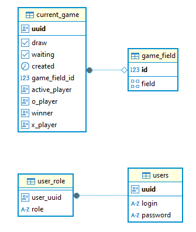

# Игра крестики нолики с jwt авторизацией

Технологии: Java 18, Spring Security 5.8, Spring MVC 5.3, Spring Data JPA 3.4, Hibernate 6.5, Tomcat 9, Gradle Kotlin
DSL.

---

## Описание

REST сервис для игры крестики нолики с поддержкой jwt авторизации. Есть возможность играть с компьютером или с другим
игроком. При игре с игроком можно выбрать игровой badge (Х или О). При игре с компьютером используется алгоритм
минимакс. Также можно посмотреть свою историю игр и таблицу лидеров.

---

## Endpoints

- Все эндпоинты требуют JWT-токена, кроме:
    - `POST /auth/reg` - регистрация
    - `POST /auth/login` - логин
    - `POST /auth/access` - обновление JWT access токена

### Авторизация

| Метод | Путь          | Описание                  | Request Dto       | Response Dto |
|-------|---------------|---------------------------|-------------------|--------------|
| POST  | /auth/reg     | Регистрация игрока        | SignUpRequest     |              |
| POST  | /auth/login   | Авторизация игрока        | JwtRequest        | JwtResponse  |
| POST  | /auth/access  | Обновление access токена  | RefreshJwtRequest | JwtResponse  |
| POST  | /auth/refresh | Обновление refresh токена | RefreshJwtRequest | JwtResponse  |

<details>
<summary>Dto</summary>

SignUpRequest

```
{
    "login" : "string (required)",
    "password" : "string (required)"
}
```

JwtRequest

```
{
    "login" : "string (required)",
    "password" : "string (required)"
}
```

RefreshJwtRequest

```
{
    "refreshToken" : "string (required)"
}
```

JwtResponse

```
{
    "type": "Bearer",
    "accessToken": "string (JWT)",
    "refreshToken": "string (JWT)"
}
```

</details>

---

### User

| Метод | Путь         | Описание                          | Response Dto |
|-------|--------------|-----------------------------------|--------------|
| POST  | /user/{uuid} | Получение игрока по Uuid          | UserDto      |
| POST  | /user        | Получение игрока по access токену | UserDto      |

<details>
<summary>Dto</summary>

UserDto

```
{
    "uuid": "UUID"
}
```

</details>

---

### Game

| Метод | Путь                  | Описание                                       | Параметры                  | Request Dto    | Response Dto   |
|-------|-----------------------|------------------------------------------------|----------------------------|----------------|----------------|
| POST  | /game                 | Создание игры (против игрока или ИИ)           | mode: string (player / ai) |                |                |
| GET   | /game                 | Получение списка игр в режиме ожидания         |                            |                | WaitingGameDto |
| PATCH | /game/{uuid}          | Присоединение к игре с выбором игрового бейджа | badge: string (x / o)      |                | WaitingGameDto |
| POST  | /game/{uuid}          | Сделать ход                                    |                            | CurrentGameDto | CurrentGameDto |
| GET   | /game/{uuid}          | Получение игры по Uuid                         |                            |                | CurrentGameDto |
| GET   | /game/finished        | Получение списка завершенных игр игрока        |                            |                | CurrentGameDto |
| GET   | /game/leaders/{limit} | Получение списка лидеров                       |                            |                | UserWinRate    |

<details>
<summary>Dto</summary>

WaitingGameDto

```
[
    {
        "uuid": "UUID",
        "created": timestamp",
        "X Player": "UUID",
        "O Player": "UUID"
    }
]
```

CurrentGameDto

```
{
    "gameField": {
        "field": [
            [
                "",
                "",
                ""
            ],
            [
                "",
                "",
                ""
            ],
            [
                "",
                "",
                ""
            ]
        ]
    },
    "activePlayer": "UUID",
    "winner": UUID,
    "created": "timestamp",
    "draw": boolean
}
```

UserWinRate

```
[
    {
        "userUuid": "UUID",
        "login": "string",
        "winRate": double
    }
]
```

</details>

---

## Модель базы данных



---

## Запуск проекта

Необходимые инструменты:

* [Java (JDK) 18](https://github.com/corretto/corretto-18/releases)
* [PostgreSQL 15](https://www.enterprisedb.com/downloads/postgres-postgresql-downloads)

Создайте БД в PostgreSQL.
Настройте подключение к БД (через application.properties). Укажите:

- `spring.datasource.url`
- `spring.datasource.username`
- `spring.datasource.password`

### С помощью командной строки

Находясь в корневой папке проекта, выполнить:

* gradlew.bat shadowJar
* java -jar build/libs/java-jwt-tactoe-1.0-all.jar

### С помощью среды разработки (IntelliJ IDEA, Eclipse, NetBeans)

* Найдите Application в src/main/java
* Нажмите ▶️ рядом с классом (или Shift+F10 в IntelliJ IDEA)